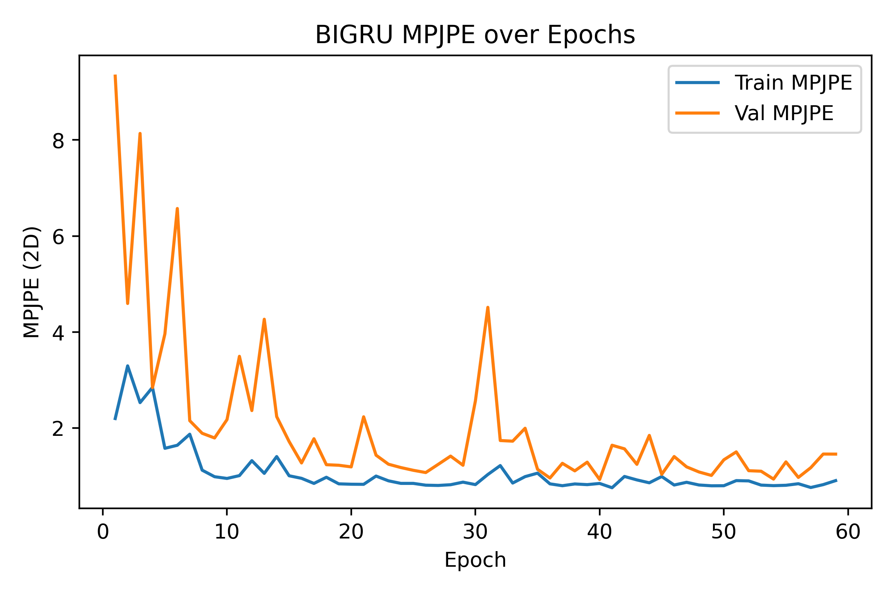

----# BIGRU Performance

- **Total params:** 0.48 M

## Model parameter breakdown

| Module       |   Params (M) |
|:-------------|-------------:|
| encoder.core |        0.461 |
| pose_head.0  |        0.001 |
| pose_head.2  |        0.022 |

## Run at 2025-05-22 02:39:17

- **Train batch size:** 64
### Epoch-wise metrics

|   epoch |   tr_mpjpe |   va_mpjpe |   tr_ade |   va_ade |   tr_fde |   va_fde |
|--------:|-----------:|-----------:|---------:|---------:|---------:|---------:|
|       1 |      2.200 |      9.329 |    0.052 |    0.380 |    0.059 |    0.349 |
|       2 |      3.297 |      4.596 |    0.110 |    0.274 |    0.116 |    0.266 |
|       3 |      2.532 |      8.136 |    0.117 |    0.131 |    0.113 |    0.113 |
|       4 |      2.849 |      2.845 |    0.087 |    0.094 |    0.082 |    0.080 |
|       5 |      1.581 |      3.963 |    0.062 |    0.176 |    0.060 |    0.151 |
|       6 |      1.644 |      6.573 |    0.074 |    0.194 |    0.071 |    0.169 |
|       7 |      1.874 |      2.156 |    0.067 |    0.053 |    0.066 |    0.055 |
|       8 |      1.126 |      1.893 |    0.042 |    0.091 |    0.044 |    0.089 |
|       9 |      0.989 |      1.796 |    0.044 |    0.061 |    0.045 |    0.062 |
|      10 |      0.953 |      2.179 |    0.037 |    0.065 |    0.039 |    0.066 |
|      11 |      1.012 |      3.496 |    0.036 |    0.075 |    0.040 |    0.075 |
|      12 |      1.324 |      2.367 |    0.046 |    0.063 |    0.048 |    0.061 |
|      13 |      1.059 |      4.268 |    0.039 |    0.089 |    0.043 |    0.087 |
|      14 |      1.409 |      2.241 |    0.045 |    0.046 |    0.048 |    0.052 |
|      15 |      1.009 |      1.722 |    0.035 |    0.057 |    0.039 |    0.061 |
|      16 |      0.956 |      1.276 |    0.038 |    0.062 |    0.042 |    0.065 |
|      17 |      0.850 |      1.780 |    0.037 |    0.069 |    0.041 |    0.072 |
|      18 |      0.978 |      1.239 |    0.041 |    0.064 |    0.044 |    0.071 |
|      19 |      0.841 |      1.228 |    0.040 |    0.040 |    0.044 |    0.046 |
|      20 |      0.833 |      1.194 |    0.033 |    0.065 |    0.037 |    0.072 |
|      21 |      0.831 |      2.237 |    0.038 |    0.040 |    0.042 |    0.044 |
|      22 |      1.003 |      1.438 |    0.034 |    0.034 |    0.038 |    0.041 |
|      23 |      0.904 |      1.250 |    0.034 |    0.037 |    0.037 |    0.044 |
|      24 |      0.850 |      1.180 |    0.032 |    0.077 |    0.036 |    0.082 |
|      25 |      0.850 |      1.123 |    0.042 |    0.053 |    0.045 |    0.055 |
|      26 |      0.813 |      1.076 |    0.036 |    0.047 |    0.039 |    0.051 |
|      27 |      0.807 |      1.246 |    0.034 |    0.035 |    0.038 |    0.040 |
|      28 |      0.823 |      1.418 |    0.031 |    0.044 |    0.035 |    0.050 |
|      29 |      0.876 |      1.228 |    0.034 |    0.041 |    0.038 |    0.044 |
|      30 |      0.825 |      2.570 |    0.032 |    0.072 |    0.036 |    0.080 |
|      31 |      1.035 |      4.515 |    0.043 |    0.127 |    0.046 |    0.126 |
|      32 |      1.221 |      1.743 |    0.050 |    0.037 |    0.056 |    0.045 |
|      33 |      0.857 |      1.729 |    0.033 |    0.062 |    0.037 |    0.062 |
|      34 |      0.991 |      1.998 |    0.041 |    0.039 |    0.043 |    0.044 |
|      35 |      1.063 |      1.144 |    0.036 |    0.043 |    0.040 |    0.047 |
|      36 |      0.841 |      0.962 |    0.034 |    0.049 |    0.038 |    0.054 |
|      37 |      0.802 |      1.268 |    0.035 |    0.051 |    0.039 |    0.055 |
|      38 |      0.839 |      1.111 |    0.034 |    0.046 |    0.038 |    0.051 |
|      39 |      0.825 |      1.292 |    0.033 |    0.033 |    0.037 |    0.039 |
|      40 |      0.849 |      0.932 |    0.032 |    0.035 |    0.035 |    0.042 |
|      41 |      0.760 |      1.645 |    0.030 |    0.043 |    0.035 |    0.048 |
|      42 |      0.995 |      1.570 |    0.034 |    0.038 |    0.038 |    0.042 |
|      43 |      0.923 |      1.247 |    0.034 |    0.037 |    0.038 |    0.040 |
|      44 |      0.863 |      1.850 |    0.032 |    0.042 |    0.036 |    0.050 |
|      45 |      0.993 |      1.039 |    0.037 |    0.037 |    0.041 |    0.045 |
|      46 |      0.816 |      1.409 |    0.032 |    0.050 |    0.037 |    0.056 |
|      47 |      0.873 |      1.194 |    0.036 |    0.048 |    0.040 |    0.053 |
|      48 |      0.817 |      1.088 |    0.034 |    0.037 |    0.037 |    0.042 |
|      49 |      0.800 |      1.016 |    0.032 |    0.035 |    0.036 |    0.039 |
|      50 |      0.802 |      1.341 |    0.031 |    0.045 |    0.035 |    0.048 |
|      51 |      0.908 |      1.506 |    0.033 |    0.052 |    0.037 |    0.055 |
|      52 |      0.902 |      1.115 |    0.033 |    0.034 |    0.037 |    0.039 |
|      53 |      0.815 |      1.104 |    0.030 |    0.030 |    0.034 |    0.035 |
|      54 |      0.803 |      0.940 |    0.029 |    0.033 |    0.034 |    0.037 |
|      55 |      0.811 |      1.298 |    0.030 |    0.034 |    0.034 |    0.038 |
|      56 |      0.843 |      0.975 |    0.033 |    0.037 |    0.036 |    0.041 |
|      57 |      0.765 |      1.178 |    0.031 |    0.030 |    0.035 |    0.036 |
|      58 |      0.825 |      1.461 |    0.030 |    0.041 |    0.034 |    0.047 |
|      59 |      0.908 |      1.460 |    0.035 |    0.044 |    0.039 |    0.048 |

### Test Results

- **MPJPE**: 1.145
- **ADE**:   0.051
- **FDE**:   0.058

### Input Modalities Used

- **Hands**: True
- **Gaze**: False
- **Object BBoxes**: False
- **Surrogate BBoxes**: False

## Learning curves

----