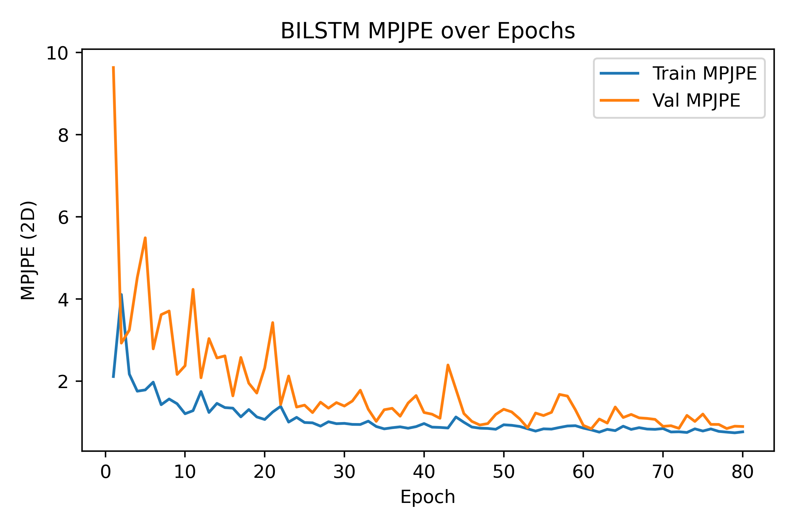

----# BILSTM Performance

- **Total params:** 0.64 M

## Model parameter breakdown

| Module       |   Params (M) |
|:-------------|-------------:|
| encoder.core |        0.614 |
| pose_head.0  |        0.001 |
| pose_head.2  |        0.022 |

## Run at 2025-05-22 02:36:27

- **Train batch size:** 64
### Epoch-wise metrics

|   epoch |   tr_mpjpe |   va_mpjpe |   tr_ade |   va_ade |   tr_fde |   va_fde |
|--------:|-----------:|-----------:|---------:|---------:|---------:|---------:|
|       1 |      2.115 |      9.633 |    0.054 |    0.395 |    0.064 |    0.357 |
|       2 |      4.110 |      2.928 |    0.151 |    0.137 |    0.156 |    0.153 |
|       3 |      2.173 |      3.246 |    0.081 |    0.107 |    0.086 |    0.091 |
|       4 |      1.758 |      4.522 |    0.070 |    0.126 |    0.072 |    0.121 |
|       5 |      1.788 |      5.490 |    0.067 |    0.138 |    0.069 |    0.133 |
|       6 |      1.978 |      2.788 |    0.063 |    0.086 |    0.065 |    0.081 |
|       7 |      1.429 |      3.620 |    0.054 |    0.139 |    0.062 |    0.147 |
|       8 |      1.568 |      3.709 |    0.070 |    0.128 |    0.075 |    0.119 |
|       9 |      1.452 |      2.165 |    0.061 |    0.064 |    0.071 |    0.068 |
|      10 |      1.209 |      2.378 |    0.051 |    0.107 |    0.057 |    0.103 |
|      11 |      1.284 |      4.236 |    0.059 |    0.073 |    0.059 |    0.067 |
|      12 |      1.750 |      2.084 |    0.057 |    0.114 |    0.057 |    0.106 |
|      13 |      1.240 |      3.038 |    0.061 |    0.098 |    0.064 |    0.092 |
|      14 |      1.461 |      2.566 |    0.057 |    0.087 |    0.059 |    0.088 |
|      15 |      1.359 |      2.617 |    0.054 |    0.078 |    0.055 |    0.075 |
|      16 |      1.345 |      1.644 |    0.053 |    0.067 |    0.054 |    0.072 |
|      17 |      1.133 |      2.579 |    0.050 |    0.063 |    0.056 |    0.066 |
|      18 |      1.311 |      1.952 |    0.052 |    0.055 |    0.054 |    0.054 |
|      19 |      1.131 |      1.712 |    0.051 |    0.068 |    0.053 |    0.064 |
|      20 |      1.069 |      2.327 |    0.052 |    0.109 |    0.053 |    0.116 |
|      21 |      1.251 |      3.427 |    0.057 |    0.202 |    0.060 |    0.212 |
|      22 |      1.390 |      1.434 |    0.075 |    0.060 |    0.080 |    0.064 |
|      23 |      1.006 |      2.127 |    0.046 |    0.058 |    0.050 |    0.061 |
|      24 |      1.121 |      1.371 |    0.048 |    0.073 |    0.051 |    0.069 |
|      25 |      0.996 |      1.418 |    0.048 |    0.047 |    0.050 |    0.050 |
|      26 |      0.988 |      1.237 |    0.044 |    0.059 |    0.045 |    0.063 |
|      27 |      0.908 |      1.490 |    0.044 |    0.067 |    0.048 |    0.063 |
|      28 |      1.014 |      1.345 |    0.048 |    0.046 |    0.049 |    0.048 |
|      29 |      0.967 |      1.480 |    0.041 |    0.050 |    0.043 |    0.053 |
|      30 |      0.975 |      1.396 |    0.043 |    0.043 |    0.046 |    0.047 |
|      31 |      0.950 |      1.518 |    0.039 |    0.049 |    0.043 |    0.052 |
|      32 |      0.947 |      1.781 |    0.041 |    0.058 |    0.044 |    0.051 |
|      33 |      1.029 |      1.317 |    0.043 |    0.041 |    0.044 |    0.043 |
|      34 |      0.898 |      1.024 |    0.039 |    0.045 |    0.041 |    0.044 |
|      35 |      0.841 |      1.307 |    0.038 |    0.044 |    0.041 |    0.051 |
|      36 |      0.869 |      1.341 |    0.037 |    0.041 |    0.041 |    0.042 |
|      37 |      0.890 |      1.149 |    0.037 |    0.061 |    0.039 |    0.070 |
|      38 |      0.856 |      1.470 |    0.040 |    0.045 |    0.044 |    0.047 |
|      39 |      0.896 |      1.652 |    0.037 |    0.056 |    0.042 |    0.051 |
|      40 |      0.970 |      1.239 |    0.043 |    0.047 |    0.048 |    0.051 |
|      41 |      0.883 |      1.198 |    0.039 |    0.038 |    0.043 |    0.041 |
|      42 |      0.876 |      1.099 |    0.036 |    0.056 |    0.040 |    0.064 |
|      43 |      0.862 |      2.395 |    0.039 |    0.064 |    0.042 |    0.067 |
|      44 |      1.130 |      1.805 |    0.045 |    0.064 |    0.047 |    0.066 |
|      45 |      1.001 |      1.213 |    0.042 |    0.042 |    0.047 |    0.046 |
|      46 |      0.885 |      1.023 |    0.036 |    0.037 |    0.039 |    0.039 |
|      47 |      0.858 |      0.935 |    0.034 |    0.038 |    0.038 |    0.043 |
|      48 |      0.851 |      0.969 |    0.035 |    0.035 |    0.039 |    0.041 |
|      49 |      0.831 |      1.193 |    0.033 |    0.047 |    0.039 |    0.043 |
|      50 |      0.940 |      1.319 |    0.040 |    0.039 |    0.041 |    0.046 |
|      51 |      0.928 |      1.253 |    0.036 |    0.045 |    0.041 |    0.051 |
|      52 |      0.900 |      1.086 |    0.036 |    0.052 |    0.042 |    0.061 |
|      53 |      0.843 |      0.867 |    0.037 |    0.035 |    0.041 |    0.043 |
|      54 |      0.787 |      1.225 |    0.033 |    0.040 |    0.037 |    0.044 |
|      55 |      0.841 |      1.165 |    0.033 |    0.041 |    0.038 |    0.048 |
|      56 |      0.835 |      1.243 |    0.034 |    0.034 |    0.039 |    0.042 |
|      57 |      0.875 |      1.679 |    0.033 |    0.042 |    0.036 |    0.046 |
|      58 |      0.911 |      1.639 |    0.035 |    0.047 |    0.040 |    0.057 |
|      59 |      0.918 |      1.304 |    0.036 |    0.040 |    0.040 |    0.044 |
|      60 |      0.859 |      0.925 |    0.034 |    0.035 |    0.039 |    0.040 |
|      61 |      0.815 |      0.844 |    0.032 |    0.034 |    0.036 |    0.041 |
|      62 |      0.761 |      1.080 |    0.031 |    0.043 |    0.036 |    0.047 |
|      63 |      0.829 |      0.982 |    0.034 |    0.036 |    0.038 |    0.040 |
|      64 |      0.798 |      1.372 |    0.032 |    0.041 |    0.037 |    0.041 |
|      65 |      0.906 |      1.117 |    0.033 |    0.041 |    0.036 |    0.045 |
|      66 |      0.828 |      1.192 |    0.034 |    0.034 |    0.037 |    0.040 |
|      67 |      0.870 |      1.109 |    0.032 |    0.037 |    0.037 |    0.041 |
|      68 |      0.836 |      1.095 |    0.032 |    0.038 |    0.036 |    0.041 |
|      69 |      0.829 |      1.071 |    0.032 |    0.034 |    0.036 |    0.039 |
|      70 |      0.848 |      0.902 |    0.032 |    0.035 |    0.037 |    0.039 |
|      71 |      0.765 |      0.917 |    0.032 |    0.034 |    0.035 |    0.039 |
|      72 |      0.770 |      0.854 |    0.031 |    0.031 |    0.035 |    0.037 |
|      73 |      0.753 |      1.168 |    0.030 |    0.039 |    0.035 |    0.043 |
|      74 |      0.841 |      1.022 |    0.033 |    0.035 |    0.037 |    0.038 |
|      75 |      0.789 |      1.201 |    0.031 |    0.043 |    0.035 |    0.046 |
|      76 |      0.839 |      0.950 |    0.033 |    0.034 |    0.037 |    0.040 |
|      77 |      0.780 |      0.949 |    0.031 |    0.030 |    0.036 |    0.036 |
|      78 |      0.762 |      0.849 |    0.029 |    0.031 |    0.035 |    0.038 |
|      79 |      0.745 |      0.906 |    0.030 |    0.037 |    0.035 |    0.041 |
|      80 |      0.768 |      0.898 |    0.031 |    0.031 |    0.036 |    0.035 |

### Test Results

- **MPJPE**: 0.912
- **ADE**:   0.035
- **FDE**:   0.041

### Input Modalities Used

- **Hands**: True
- **Gaze**: False
- **Object BBoxes**: False
- **Surrogate BBoxes**: False

## Learning curves

----