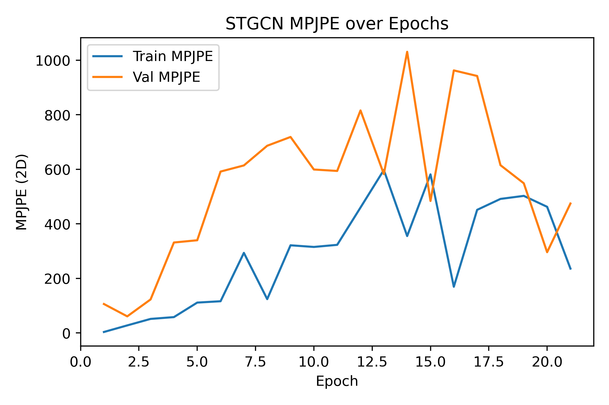

----# STGCN Performance

- **Total params:** 1.74 M

## Model parameter breakdown

| Module                           |   Params (M) |
|:---------------------------------|-------------:|
| encoder.core.net.0.conv_spatial  |        0.000 |
| encoder.core.net.0.conv_temporal |        0.037 |
| encoder.core.net.0.bn            |        0.000 |
| encoder.core.net.1.conv_spatial  |        0.008 |
| encoder.core.net.1.conv_temporal |        0.148 |
| encoder.core.net.1.bn            |        0.000 |
| encoder.core.net.2.conv_spatial  |        0.033 |
| encoder.core.net.2.conv_temporal |        0.590 |
| encoder.core.net.2.bn            |        0.001 |
| pose_head.0                      |        0.022 |
| pose_head.2                      |        0.903 |

## Run at 2025-05-22 03:11:14

- **Train batch size:** 64
### Epoch-wise metrics

|   epoch |   tr_mpjpe |   va_mpjpe |   tr_ade |   va_ade |   tr_fde |   va_fde |
|--------:|-----------:|-----------:|---------:|---------:|---------:|---------:|
|       1 |      4.455 |    168.962 |    0.121 |    9.296 |    0.132 |    9.471 |
|       2 |    151.613 |    149.337 |    6.530 |    2.539 |    6.413 |    2.327 |
|       3 |     89.517 |    135.183 |    3.692 |    4.276 |    6.159 |    5.382 |
|       4 |    132.174 |    179.579 |    4.672 |    5.739 |    7.219 |    7.592 |
|       5 |    128.129 |    424.455 |    4.601 |   21.932 |    7.383 |   25.266 |
|       6 |    129.217 |    401.843 |    6.623 |   19.243 |    6.701 |   20.629 |
|       7 |    309.337 |    387.623 |   14.257 |   17.815 |   20.452 |   19.812 |
|       8 |     88.623 |    907.967 |    4.023 |   39.026 |    4.311 |   33.956 |
|       9 |    509.966 |    801.882 |   22.047 |   38.352 |   17.079 |   39.762 |
|      10 |    329.198 |    901.897 |   16.317 |   46.096 |   18.660 |   54.405 |
|      11 |    620.369 |    746.134 |   30.266 |   26.732 |   46.443 |   30.830 |
|      12 |    365.630 |    593.887 |   15.115 |   21.601 |   21.860 |   22.221 |
|      13 |    215.420 |    725.676 |    7.609 |   24.271 |   12.675 |    9.562 |
|      14 |    566.078 |    742.212 |   18.000 |   17.587 |   10.860 |   18.139 |
|      15 |    512.725 |    385.041 |   11.892 |    6.097 |   15.093 |    4.645 |
|      16 |    258.070 |    979.358 |    3.844 |   26.188 |    5.220 |   17.216 |
|      17 |    637.552 |    603.561 |   18.753 |   19.797 |   10.286 |   12.191 |
|      18 |    370.091 |    631.283 |   11.627 |   20.029 |    6.531 |   21.896 |
|      19 |    410.106 |    506.182 |   10.478 |   12.638 |   16.817 |    9.427 |
|      20 |    551.372 |    237.226 |   13.800 |    7.535 |   11.993 |    5.108 |
|      21 |     54.255 |    296.731 |    1.685 |    5.861 |    1.498 |    4.887 |
|      22 |    320.790 |    310.361 |    5.681 |   12.664 |    4.027 |    8.224 |

### Test Results

- **MPJPE**: 184.824
- **ADE**:   5.704
- **FDE**:   8.417

### Input Modalities Used

- **Hands**: True
- **Gaze**: False
- **Object BBoxes**: False
- **Surrogate BBoxes**: False

## Learning curves

--------

# STGCN Performance

- **Total params:** 1.75 M

## Model parameter breakdown

| Module                           |   Params (M) |
|:---------------------------------|-------------:|
| encoder.input_proj               |        0.008 |
| encoder.core.net.0.conv_spatial  |        0.000 |
| encoder.core.net.0.conv_temporal |        0.037 |
| encoder.core.net.0.bn            |        0.000 |
| encoder.core.net.1.conv_spatial  |        0.008 |
| encoder.core.net.1.conv_temporal |        0.148 |
| encoder.core.net.1.bn            |        0.000 |
| encoder.core.net.2.conv_spatial  |        0.033 |
| encoder.core.net.2.conv_temporal |        0.590 |
| encoder.core.net.2.bn            |        0.001 |
| pose_head.0                      |        0.022 |
| pose_head.2                      |        0.903 |

## Run at 2025-05-22 04:45:46

- **Train batch size:** 64
### Epoch-wise metrics

|   epoch |   tr_mpjpe |   va_mpjpe |   tr_ade |   va_ade |   tr_fde |   va_fde |
|--------:|-----------:|-----------:|---------:|---------:|---------:|---------:|
|       1 |      3.617 |    106.223 |    0.091 |    3.142 |    0.093 |    3.449 |
|       2 |     27.757 |     60.936 |    0.500 |    1.150 |    0.726 |    1.224 |
|       3 |     51.562 |    122.943 |    0.962 |    2.407 |    1.395 |    4.127 |
|       4 |     58.172 |    331.716 |    1.102 |   10.497 |    1.764 |   12.536 |
|       5 |    111.409 |    339.951 |    3.531 |    8.196 |    4.609 |    7.828 |
|       6 |    116.330 |    591.825 |    2.175 |   16.559 |    2.638 |   16.863 |
|       7 |    293.651 |    614.321 |    8.108 |   19.548 |    6.048 |   20.875 |
|       8 |    124.141 |    686.490 |    3.492 |   14.931 |    4.768 |   14.317 |
|       9 |    321.483 |    718.707 |    7.032 |   18.552 |    4.191 |   19.467 |
|      10 |    315.437 |    599.369 |    8.592 |   22.922 |   13.223 |   31.940 |
|      11 |    323.141 |    594.096 |   13.072 |   26.110 |   18.987 |   31.993 |
|      12 |    460.021 |    815.908 |   19.965 |   35.351 |   31.074 |   34.657 |
|      13 |    597.541 |    582.683 |   25.538 |   11.675 |   26.817 |   13.345 |
|      14 |    355.472 |   1030.932 |    7.966 |   27.833 |    7.357 |   23.705 |
|      15 |    581.512 |    484.106 |   17.293 |    5.833 |   17.808 |    6.873 |
|      16 |    169.578 |    962.772 |    2.730 |   21.967 |    5.286 |   18.541 |
|      17 |    451.464 |    942.344 |   10.517 |   27.350 |   11.143 |   27.220 |
|      18 |    491.567 |    615.255 |   15.174 |    5.521 |   13.463 |    5.398 |
|      19 |    502.699 |    548.863 |    4.983 |   21.269 |    5.004 |   21.923 |
|      20 |    462.609 |    296.195 |   17.837 |   12.763 |   19.064 |   10.361 |
|      21 |    236.039 |    474.665 |    9.951 |   13.886 |    9.697 |   11.642 |

### Test Results

- **MPJPE**: 261.022
- **ADE**:   5.931
- **FDE**:   5.182

### Input Modalities Used

- **Hands**: True
- **Gaze**: True
- **Object BBoxes**: False
- **Surrogate BBoxes**: True

## Learning curves

--------

# STGCN Performance

- **Total params:** 1.76 M

## Model parameter breakdown

| Module                           |   Params (M) |
|:---------------------------------|-------------:|
| encoder.input_proj               |        0.018 |
| encoder.core.net.0.conv_spatial  |        0.000 |
| encoder.core.net.0.conv_temporal |        0.037 |
| encoder.core.net.0.bn            |        0.000 |
| encoder.core.net.1.conv_spatial  |        0.008 |
| encoder.core.net.1.conv_temporal |        0.148 |
| encoder.core.net.1.bn            |        0.000 |
| encoder.core.net.2.conv_spatial  |        0.033 |
| encoder.core.net.2.conv_temporal |        0.590 |
| encoder.core.net.2.bn            |        0.001 |
| pose_head.0                      |        0.022 |
| pose_head.2                      |        0.903 |

## Run at 2025-05-22 04:50:17

- **Train batch size:** 64
### Epoch-wise metrics

|   epoch |   tr_mpjpe |   va_mpjpe |   tr_ade |   va_ade |   tr_fde |   va_fde |
|--------:|-----------:|-----------:|---------:|---------:|---------:|---------:|
|       1 |      3.514 |     53.666 |    0.093 |    1.495 |    0.093 |    1.138 |
|       2 |     29.542 |    101.514 |    0.996 |    3.044 |    2.765 |    2.272 |
|       3 |     37.076 |    196.706 |    1.171 |    5.189 |    2.403 |    5.847 |
|       4 |     59.034 |    238.618 |    1.556 |    5.897 |    1.444 |    7.549 |
|       5 |     74.532 |    316.931 |    2.024 |    9.607 |    4.433 |    6.529 |
|       6 |    119.332 |    437.463 |    2.995 |   10.938 |    2.800 |    9.508 |
|       7 |     95.693 |    562.654 |    2.478 |   10.223 |    2.465 |    8.903 |
|       8 |    175.444 |    642.735 |    3.642 |    6.853 |    3.007 |    4.931 |
|       9 |    647.718 |    780.847 |    8.983 |    7.826 |    7.321 |    8.523 |
|      10 |    374.630 |   1201.981 |    3.801 |    6.628 |    4.035 |    7.148 |
|      11 |    436.056 |    925.895 |    4.383 |    8.078 |    3.348 |    8.199 |
|      12 |    405.096 |    887.115 |    3.851 |    4.944 |    3.331 |    4.862 |
|      13 |    401.648 |    944.041 |    2.275 |    8.733 |    2.545 |    9.262 |
|      14 |    566.745 |   1564.962 |    4.944 |    9.390 |    5.957 |    9.943 |
|      15 |   1426.334 |    971.637 |    9.419 |   11.063 |    9.941 |   13.074 |
|      16 |    854.513 |    353.236 |   11.204 |    3.299 |   15.092 |    3.518 |
|      17 |    178.933 |    603.227 |    1.905 |   13.836 |    1.792 |   21.479 |
|      18 |    957.916 |    540.819 |   22.019 |   10.142 |   20.538 |   10.993 |
|      19 |    405.052 |    464.897 |    8.389 |   13.861 |    7.176 |   13.614 |
|      20 |    362.109 |    630.847 |   10.736 |   21.493 |    8.957 |   22.306 |

### Test Results

- **MPJPE**: 125.746
- **ADE**:   4.112
- **FDE**:   2.993

### Input Modalities Used

- **Hands**: True
- **Gaze**: True
- **Object BBoxes**: True
- **Surrogate BBoxes**: True

## Learning curves

--------

# STGCN Performance

- **Total params:** 1.76 M

## Model parameter breakdown

| Module                           |   Params (M) |
|:---------------------------------|-------------:|
| encoder.input_proj               |        0.018 |
| encoder.core.net.0.conv_spatial  |        0.000 |
| encoder.core.net.0.conv_temporal |        0.037 |
| encoder.core.net.0.bn            |        0.000 |
| encoder.core.net.1.conv_spatial  |        0.008 |
| encoder.core.net.1.conv_temporal |        0.148 |
| encoder.core.net.1.bn            |        0.000 |
| encoder.core.net.2.conv_spatial  |        0.033 |
| encoder.core.net.2.conv_temporal |        0.590 |
| encoder.core.net.2.bn            |        0.001 |
| pose_head.0                      |        0.022 |
| pose_head.2                      |        0.903 |

## Run at 2025-05-22 05:54:58

- **Train batch size:** 64
### Epoch-wise metrics

|   epoch |   tr_mpjpe |   va_mpjpe |   tr_ade |   va_ade |   tr_fde |   va_fde |
|--------:|-----------:|-----------:|---------:|---------:|---------:|---------:|
|       1 |      2.960 |     36.826 |    0.073 |    0.384 |    0.074 |    0.386 |
|       2 |     14.084 |     34.193 |    0.162 |    0.260 |    0.270 |    0.289 |
|       3 |     11.906 |     70.640 |    0.154 |    0.973 |    0.177 |    1.073 |
|       4 |     48.096 |    109.750 |    0.597 |    1.519 |    0.762 |    1.688 |
|       5 |     52.520 |    104.833 |    0.801 |    0.947 |    0.756 |    0.846 |
|       6 |     70.670 |    147.363 |    0.450 |    3.185 |    0.415 |    3.410 |
|       7 |     81.936 |    175.103 |    1.843 |    3.119 |    1.901 |    2.842 |
|       8 |     47.692 |    285.067 |    0.798 |    4.386 |    0.837 |    3.617 |
|       9 |     72.541 |    154.865 |    1.147 |    2.494 |    0.924 |    1.855 |
|      10 |     33.736 |    396.928 |    0.521 |    5.132 |    0.828 |    4.765 |
|      11 |    114.309 |    567.860 |    1.481 |   15.800 |    1.590 |   11.081 |
|      12 |    242.869 |    375.931 |    6.146 |   10.002 |    3.860 |    8.258 |
|      13 |    196.927 |    530.994 |    4.564 |    9.881 |    3.866 |    7.372 |
|      14 |    441.695 |    380.157 |    8.843 |    3.943 |    5.896 |    2.936 |
|      15 |    368.555 |    214.024 |    2.985 |    6.442 |    2.561 |    6.449 |
|      16 |    206.932 |    185.771 |    6.476 |    2.170 |    6.058 |    1.871 |
|      17 |     77.014 |    137.254 |    1.198 |    0.941 |    1.331 |    0.520 |
|      18 |     70.220 |    222.881 |    0.653 |    7.630 |    0.544 |    6.761 |
|      19 |    211.313 |    168.357 |    7.547 |    3.071 |    6.309 |    3.127 |
|      20 |    162.072 |    115.695 |    3.178 |    2.787 |    3.783 |    2.622 |
|      21 |    125.300 |    171.475 |    2.765 |    4.079 |    2.303 |    4.299 |

### Test Results

- **MPJPE**: 71.999
- **ADE**:   0.572
- **FDE**:   0.630

### Input Modalities Used

- **Hands**: True
- **Gaze**: True
- **Object BBoxes**: True
- **Surrogate BBoxes**: True

## Learning curves

--------

# STGCN Performance

- **Total params:** 1.75 M

## Model parameter breakdown

| Module                           |   Params (M) |
|:---------------------------------|-------------:|
| encoder.input_proj               |        0.007 |
| encoder.core.net.0.conv_spatial  |        0.000 |
| encoder.core.net.0.conv_temporal |        0.037 |
| encoder.core.net.0.bn            |        0.000 |
| encoder.core.net.1.conv_spatial  |        0.008 |
| encoder.core.net.1.conv_temporal |        0.148 |
| encoder.core.net.1.bn            |        0.000 |
| encoder.core.net.2.conv_spatial  |        0.033 |
| encoder.core.net.2.conv_temporal |        0.590 |
| encoder.core.net.2.bn            |        0.001 |
| pose_head.0                      |        0.022 |
| pose_head.2                      |        0.903 |

## Run at 2025-05-22 05:58:05

- **Train batch size:** 64
### Epoch-wise metrics

|   epoch |   tr_mpjpe |   va_mpjpe |   tr_ade |   va_ade |   tr_fde |   va_fde |
|--------:|-----------:|-----------:|---------:|---------:|---------:|---------:|
|       1 |      2.993 |     26.355 |    0.068 |    0.799 |    0.067 |    1.087 |
|       2 |     25.126 |     47.586 |    1.156 |    2.584 |    1.830 |    2.062 |
|       3 |     18.685 |     96.757 |    0.897 |    4.932 |    0.629 |    4.896 |
|       4 |     48.676 |     87.448 |    2.233 |    2.777 |    3.498 |    4.054 |
|       5 |     38.701 |     88.767 |    1.063 |    0.998 |    0.961 |    2.073 |
|       6 |     51.546 |    137.672 |    1.257 |    3.090 |    2.552 |    4.953 |
|       7 |     51.281 |    183.862 |    1.201 |    4.345 |    2.524 |    4.431 |
|       8 |     40.741 |    243.989 |    0.780 |    5.927 |    1.124 |    5.556 |
|       9 |     83.442 |    205.347 |    2.040 |    6.540 |    2.032 |    6.890 |
|      10 |     75.336 |     74.632 |    2.328 |    2.352 |    3.027 |    1.505 |
|      11 |     25.004 |    190.019 |    0.771 |    5.481 |    1.175 |    6.219 |
|      12 |     82.701 |    405.966 |    2.489 |   16.873 |    4.235 |   20.984 |
|      13 |    364.959 |    214.827 |   15.399 |   10.613 |   25.105 |   12.044 |
|      14 |     99.278 |    201.715 |    4.306 |    8.233 |    3.564 |    6.375 |
|      15 |     88.496 |    277.610 |    3.408 |    7.099 |    3.265 |    7.729 |
|      16 |    331.788 |    229.929 |    9.746 |    3.055 |    9.168 |    3.523 |
|      17 |     99.286 |    259.287 |    2.032 |    4.700 |    3.559 |    3.604 |
|      18 |    219.836 |    302.455 |    2.892 |    2.715 |    4.712 |    2.763 |
|      19 |    203.341 |    227.304 |    2.384 |    3.536 |    2.203 |    3.884 |
|      20 |    294.479 |    255.695 |    4.601 |    2.989 |    4.888 |    3.306 |

### Test Results

- **MPJPE**: 51.915
- **ADE**:   1.271
- **FDE**:   1.561

### Input Modalities Used

- **Hands**: True
- **Gaze**: False
- **Object BBoxes**: False
- **Surrogate BBoxes**: False

## Learning curves

----