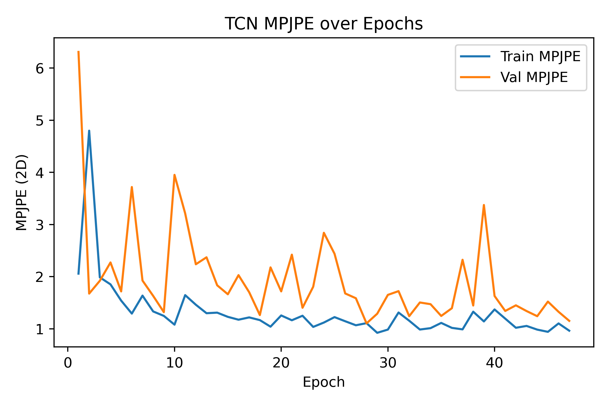
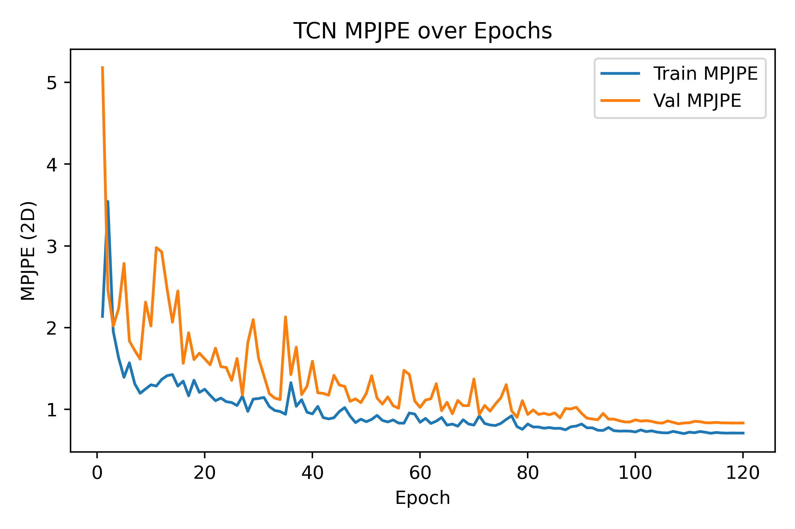
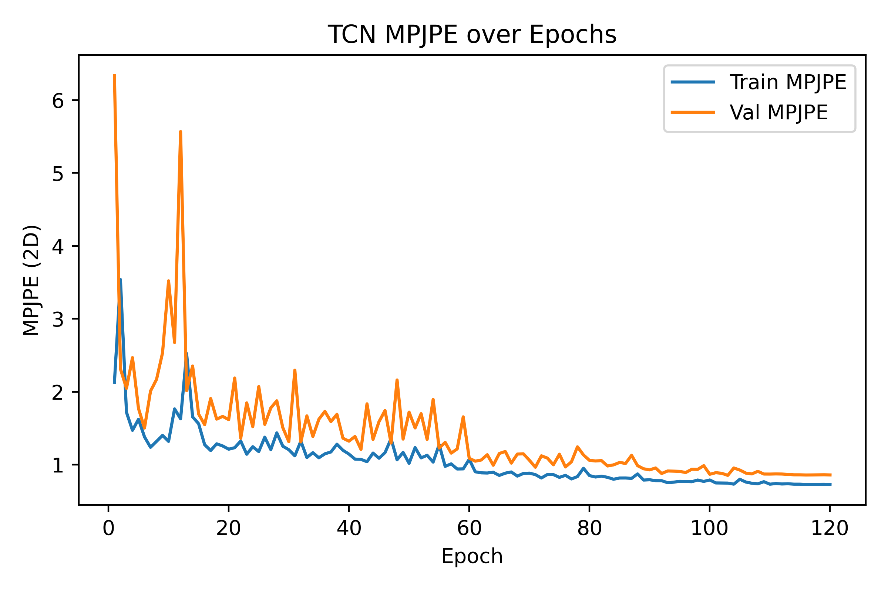

----# TCN Performance

- **Total params:** 0.26 M

## Model parameter breakdown

| Module          |   Params (M) |
|:----------------|-------------:|
| encoder.core.0  |        0.036 |
| encoder.core.2  |        0.015 |
| encoder.core.3  |        0.049 |
| encoder.core.5  |        0.015 |
| encoder.core.6  |        0.049 |
| encoder.core.8  |        0.015 |
| encoder.core.9  |        0.049 |
| encoder.core.11 |        0.015 |
| pose_head.0     |        0.000 |
| pose_head.2     |        0.011 |

## Run at 2025-05-22 03:34:59

- **Train batch size:** 64
### Epoch-wise metrics

|   epoch |   tr_mpjpe |   va_mpjpe |   tr_ade |   va_ade |   tr_fde |   va_fde |
|--------:|-----------:|-----------:|---------:|---------:|---------:|---------:|
|       1 |      2.057 |      6.308 |    0.054 |    0.205 |    0.061 |    0.193 |
|       2 |      4.798 |      1.675 |    0.135 |    0.062 |    0.127 |    0.066 |
|       3 |      1.986 |      1.920 |    0.061 |    0.063 |    0.062 |    0.065 |
|       4 |      1.852 |      2.272 |    0.057 |    0.075 |    0.058 |    0.075 |
|       5 |      1.540 |      1.717 |    0.056 |    0.066 |    0.058 |    0.070 |
|       6 |      1.291 |      3.718 |    0.052 |    0.062 |    0.054 |    0.063 |
|       7 |      1.636 |      1.925 |    0.051 |    0.079 |    0.054 |    0.077 |
|       8 |      1.333 |      1.631 |    0.053 |    0.059 |    0.054 |    0.058 |
|       9 |      1.247 |      1.319 |    0.050 |    0.053 |    0.052 |    0.055 |
|      10 |      1.079 |      3.951 |    0.045 |    0.085 |    0.047 |    0.084 |
|      11 |      1.645 |      3.212 |    0.054 |    0.061 |    0.058 |    0.062 |
|      12 |      1.461 |      2.237 |    0.051 |    0.085 |    0.052 |    0.087 |
|      13 |      1.299 |      2.370 |    0.048 |    0.069 |    0.049 |    0.067 |
|      14 |      1.310 |      1.834 |    0.047 |    0.053 |    0.048 |    0.056 |
|      15 |      1.229 |      1.662 |    0.045 |    0.083 |    0.047 |    0.082 |
|      16 |      1.174 |      2.028 |    0.051 |    0.055 |    0.052 |    0.054 |
|      17 |      1.218 |      1.701 |    0.050 |    0.059 |    0.051 |    0.063 |
|      18 |      1.167 |      1.263 |    0.049 |    0.049 |    0.050 |    0.051 |
|      19 |      1.040 |      2.177 |    0.044 |    0.053 |    0.045 |    0.054 |
|      20 |      1.256 |      1.718 |    0.046 |    0.073 |    0.047 |    0.071 |
|      21 |      1.164 |      2.421 |    0.047 |    0.072 |    0.047 |    0.078 |
|      22 |      1.250 |      1.404 |    0.049 |    0.051 |    0.050 |    0.052 |
|      23 |      1.036 |      1.806 |    0.043 |    0.055 |    0.045 |    0.057 |
|      24 |      1.119 |      2.840 |    0.044 |    0.093 |    0.046 |    0.092 |
|      25 |      1.224 |      2.438 |    0.047 |    0.063 |    0.048 |    0.065 |
|      26 |      1.145 |      1.677 |    0.047 |    0.053 |    0.048 |    0.055 |
|      27 |      1.068 |      1.586 |    0.043 |    0.060 |    0.044 |    0.061 |
|      28 |      1.108 |      1.104 |    0.043 |    0.055 |    0.045 |    0.057 |
|      29 |      0.923 |      1.289 |    0.042 |    0.054 |    0.044 |    0.054 |
|      30 |      0.985 |      1.650 |    0.042 |    0.051 |    0.043 |    0.053 |
|      31 |      1.312 |      1.722 |    0.052 |    0.052 |    0.052 |    0.052 |
|      32 |      1.155 |      1.242 |    0.042 |    0.058 |    0.043 |    0.060 |
|      33 |      0.986 |      1.504 |    0.043 |    0.051 |    0.044 |    0.052 |
|      34 |      1.012 |      1.472 |    0.043 |    0.049 |    0.044 |    0.050 |
|      35 |      1.113 |      1.246 |    0.043 |    0.060 |    0.044 |    0.060 |
|      36 |      1.018 |      1.395 |    0.044 |    0.047 |    0.044 |    0.046 |
|      37 |      0.989 |      2.323 |    0.040 |    0.072 |    0.041 |    0.074 |
|      38 |      1.328 |      1.447 |    0.049 |    0.052 |    0.052 |    0.054 |
|      39 |      1.141 |      3.373 |    0.046 |    0.111 |    0.046 |    0.115 |
|      40 |      1.371 |      1.629 |    0.055 |    0.057 |    0.059 |    0.058 |
|      41 |      1.195 |      1.342 |    0.048 |    0.064 |    0.050 |    0.067 |
|      42 |      1.019 |      1.450 |    0.047 |    0.049 |    0.049 |    0.050 |
|      43 |      1.055 |      1.340 |    0.044 |    0.048 |    0.046 |    0.051 |
|      44 |      0.984 |      1.241 |    0.043 |    0.046 |    0.044 |    0.047 |
|      45 |      0.942 |      1.521 |    0.041 |    0.059 |    0.043 |    0.062 |
|      46 |      1.103 |      1.326 |    0.049 |    0.048 |    0.049 |    0.050 |
|      47 |      0.963 |      1.152 |    0.042 |    0.050 |    0.043 |    0.052 |

### Test Results

- **MPJPE**: 1.532
- **ADE**:   0.088
- **FDE**:   0.094

### Input Modalities Used

- **Hands**: True
- **Gaze**: True
- **Object BBoxes**: False
- **Surrogate BBoxes**: True

## Learning curves

--------# TCN Performance

- **Total params:** 0.25 M

## Model parameter breakdown

| Module          |   Params (M) |
|:----------------|-------------:|
| encoder.core.0  |        0.032 |
| encoder.core.2  |        0.015 |
| encoder.core.3  |        0.049 |
| encoder.core.5  |        0.015 |
| encoder.core.6  |        0.049 |
| encoder.core.8  |        0.015 |
| encoder.core.9  |        0.049 |
| encoder.core.11 |        0.015 |
| pose_head.0     |        0.000 |
| pose_head.2     |        0.011 |

## Run at 2025-05-22 03:44:58

- **Train batch size:** 64
### Epoch-wise metrics

|   epoch |   tr_mpjpe |   va_mpjpe |   tr_ade |   va_ade |   tr_fde |   va_fde |
|--------:|-----------:|-----------:|---------:|---------:|---------:|---------:|
|       1 |      2.137 |      5.179 |    0.060 |    0.220 |    0.061 |    0.218 |
|       2 |      3.543 |      2.466 |    0.112 |    0.069 |    0.121 |    0.069 |
|       3 |      1.956 |      2.019 |    0.058 |    0.083 |    0.059 |    0.085 |
|       4 |      1.630 |      2.232 |    0.055 |    0.066 |    0.056 |    0.066 |
|       5 |      1.392 |      2.785 |    0.050 |    0.075 |    0.050 |    0.073 |
|       6 |      1.569 |      1.837 |    0.053 |    0.061 |    0.054 |    0.059 |
|       7 |      1.313 |      1.720 |    0.049 |    0.079 |    0.049 |    0.078 |
|       8 |      1.197 |      1.615 |    0.050 |    0.061 |    0.051 |    0.063 |
|       9 |      1.249 |      2.312 |    0.048 |    0.057 |    0.050 |    0.066 |
|      10 |      1.301 |      2.020 |    0.048 |    0.065 |    0.050 |    0.063 |
|      11 |      1.285 |      2.979 |    0.047 |    0.096 |    0.048 |    0.108 |
|      12 |      1.366 |      2.926 |    0.051 |    0.073 |    0.051 |    0.078 |
|      13 |      1.412 |      2.474 |    0.057 |    0.071 |    0.059 |    0.073 |
|      14 |      1.426 |      2.067 |    0.055 |    0.107 |    0.056 |    0.107 |
|      15 |      1.285 |      2.448 |    0.057 |    0.058 |    0.058 |    0.060 |
|      16 |      1.346 |      1.563 |    0.056 |    0.059 |    0.058 |    0.059 |
|      17 |      1.166 |      1.936 |    0.050 |    0.059 |    0.051 |    0.060 |
|      18 |      1.356 |      1.609 |    0.052 |    0.055 |    0.053 |    0.056 |
|      19 |      1.208 |      1.687 |    0.052 |    0.057 |    0.052 |    0.058 |
|      20 |      1.246 |      1.617 |    0.051 |    0.062 |    0.052 |    0.067 |
|      21 |      1.172 |      1.545 |    0.049 |    0.059 |    0.051 |    0.062 |
|      22 |      1.106 |      1.748 |    0.049 |    0.064 |    0.050 |    0.064 |
|      23 |      1.138 |      1.523 |    0.049 |    0.072 |    0.049 |    0.071 |
|      24 |      1.094 |      1.512 |    0.050 |    0.060 |    0.051 |    0.061 |
|      25 |      1.084 |      1.354 |    0.048 |    0.053 |    0.049 |    0.053 |
|      26 |      1.047 |      1.623 |    0.047 |    0.054 |    0.047 |    0.054 |
|      27 |      1.162 |      1.177 |    0.051 |    0.065 |    0.051 |    0.065 |
|      28 |      0.975 |      1.817 |    0.050 |    0.068 |    0.051 |    0.070 |
|      29 |      1.126 |      2.097 |    0.053 |    0.061 |    0.053 |    0.058 |
|      30 |      1.133 |      1.625 |    0.050 |    0.077 |    0.051 |    0.078 |
|      31 |      1.146 |      1.411 |    0.056 |    0.052 |    0.058 |    0.055 |
|      32 |      1.034 |      1.191 |    0.047 |    0.051 |    0.049 |    0.052 |
|      33 |      0.987 |      1.138 |    0.047 |    0.052 |    0.047 |    0.053 |
|      34 |      0.974 |      1.119 |    0.046 |    0.053 |    0.046 |    0.052 |
|      35 |      0.940 |      2.131 |    0.045 |    0.078 |    0.046 |    0.069 |
|      36 |      1.326 |      1.426 |    0.053 |    0.053 |    0.053 |    0.055 |
|      37 |      1.038 |      1.762 |    0.045 |    0.057 |    0.047 |    0.066 |
|      38 |      1.118 |      1.181 |    0.046 |    0.049 |    0.049 |    0.049 |
|      39 |      0.965 |      1.283 |    0.042 |    0.048 |    0.044 |    0.051 |
|      40 |      0.945 |      1.588 |    0.041 |    0.063 |    0.043 |    0.067 |
|      41 |      1.036 |      1.203 |    0.045 |    0.045 |    0.045 |    0.050 |
|      42 |      0.900 |      1.196 |    0.041 |    0.046 |    0.044 |    0.058 |
|      43 |      0.883 |      1.173 |    0.039 |    0.052 |    0.043 |    0.057 |
|      44 |      0.898 |      1.416 |    0.042 |    0.062 |    0.044 |    0.062 |
|      45 |      0.974 |      1.297 |    0.044 |    0.053 |    0.045 |    0.057 |
|      46 |      1.022 |      1.281 |    0.043 |    0.053 |    0.045 |    0.055 |
|      47 |      0.918 |      1.099 |    0.045 |    0.051 |    0.047 |    0.056 |
|      48 |      0.838 |      1.128 |    0.040 |    0.040 |    0.042 |    0.043 |
|      49 |      0.880 |      1.083 |    0.038 |    0.047 |    0.040 |    0.045 |
|      50 |      0.849 |      1.194 |    0.039 |    0.046 |    0.041 |    0.048 |
|      51 |      0.877 |      1.411 |    0.038 |    0.065 |    0.040 |    0.073 |
|      52 |      0.926 |      1.139 |    0.044 |    0.047 |    0.047 |    0.049 |
|      53 |      0.865 |      1.065 |    0.039 |    0.040 |    0.041 |    0.043 |
|      54 |      0.846 |      1.152 |    0.037 |    0.045 |    0.039 |    0.048 |
|      55 |      0.871 |      1.045 |    0.040 |    0.042 |    0.044 |    0.046 |
|      56 |      0.832 |      1.014 |    0.037 |    0.043 |    0.041 |    0.048 |
|      57 |      0.831 |      1.477 |    0.037 |    0.043 |    0.040 |    0.044 |
|      58 |      0.956 |      1.427 |    0.038 |    0.042 |    0.039 |    0.044 |
|      59 |      0.943 |      1.102 |    0.038 |    0.040 |    0.039 |    0.042 |
|      60 |      0.842 |      1.025 |    0.036 |    0.047 |    0.038 |    0.049 |
|      61 |      0.890 |      1.113 |    0.040 |    0.041 |    0.042 |    0.046 |
|      62 |      0.828 |      1.130 |    0.036 |    0.038 |    0.039 |    0.042 |
|      63 |      0.856 |      1.314 |    0.036 |    0.042 |    0.037 |    0.043 |
|      64 |      0.901 |      0.985 |    0.036 |    0.041 |    0.038 |    0.045 |
|      65 |      0.808 |      1.086 |    0.036 |    0.039 |    0.038 |    0.041 |
|      66 |      0.820 |      0.947 |    0.036 |    0.042 |    0.038 |    0.045 |
|      67 |      0.794 |      1.109 |    0.036 |    0.049 |    0.039 |    0.055 |
|      68 |      0.873 |      1.045 |    0.040 |    0.041 |    0.045 |    0.044 |
|      69 |      0.821 |      1.046 |    0.035 |    0.044 |    0.038 |    0.046 |
|      70 |      0.808 |      1.372 |    0.038 |    0.053 |    0.040 |    0.057 |
|      71 |      0.921 |      0.939 |    0.040 |    0.041 |    0.043 |    0.042 |
|      72 |      0.827 |      1.048 |    0.036 |    0.046 |    0.038 |    0.048 |
|      73 |      0.809 |      0.979 |    0.037 |    0.038 |    0.039 |    0.041 |
|      74 |      0.803 |      1.067 |    0.035 |    0.039 |    0.038 |    0.042 |
|      75 |      0.828 |      1.141 |    0.035 |    0.046 |    0.037 |    0.050 |
|      76 |      0.877 |      1.302 |    0.038 |    0.041 |    0.042 |    0.045 |
|      77 |      0.921 |      0.983 |    0.036 |    0.037 |    0.038 |    0.041 |
|      78 |      0.789 |      0.902 |    0.034 |    0.038 |    0.036 |    0.041 |
|      79 |      0.756 |      1.107 |    0.034 |    0.039 |    0.037 |    0.041 |
|      80 |      0.821 |      0.938 |    0.036 |    0.039 |    0.037 |    0.041 |
|      81 |      0.784 |      0.993 |    0.036 |    0.039 |    0.038 |    0.041 |
|      82 |      0.785 |      0.938 |    0.035 |    0.038 |    0.037 |    0.041 |
|      83 |      0.770 |      0.951 |    0.035 |    0.037 |    0.037 |    0.040 |
|      84 |      0.778 |      0.934 |    0.034 |    0.038 |    0.036 |    0.039 |
|      85 |      0.767 |      0.957 |    0.035 |    0.036 |    0.036 |    0.040 |
|      86 |      0.769 |      0.897 |    0.034 |    0.036 |    0.037 |    0.039 |
|      87 |      0.750 |      1.011 |    0.034 |    0.037 |    0.036 |    0.041 |
|      88 |      0.787 |      1.005 |    0.034 |    0.038 |    0.036 |    0.040 |
|      89 |      0.796 |      1.026 |    0.034 |    0.038 |    0.036 |    0.040 |
|      90 |      0.821 |      0.952 |    0.035 |    0.038 |    0.036 |    0.041 |
|      91 |      0.774 |      0.893 |    0.035 |    0.037 |    0.037 |    0.041 |
|      92 |      0.774 |      0.882 |    0.034 |    0.037 |    0.037 |    0.040 |
|      93 |      0.745 |      0.874 |    0.034 |    0.037 |    0.036 |    0.040 |
|      94 |      0.742 |      0.950 |    0.033 |    0.037 |    0.036 |    0.040 |
|      95 |      0.778 |      0.881 |    0.033 |    0.036 |    0.036 |    0.039 |
|      96 |      0.739 |      0.881 |    0.033 |    0.036 |    0.035 |    0.039 |
|      97 |      0.734 |      0.862 |    0.033 |    0.036 |    0.035 |    0.040 |
|      98 |      0.735 |      0.846 |    0.033 |    0.036 |    0.036 |    0.039 |
|      99 |      0.734 |      0.847 |    0.033 |    0.036 |    0.036 |    0.039 |
|     100 |      0.724 |      0.872 |    0.032 |    0.036 |    0.035 |    0.039 |
|     101 |      0.749 |      0.857 |    0.033 |    0.036 |    0.036 |    0.039 |
|     102 |      0.728 |      0.862 |    0.032 |    0.035 |    0.035 |    0.039 |
|     103 |      0.738 |      0.853 |    0.032 |    0.035 |    0.035 |    0.039 |
|     104 |      0.722 |      0.837 |    0.032 |    0.035 |    0.035 |    0.039 |
|     105 |      0.714 |      0.832 |    0.032 |    0.035 |    0.035 |    0.039 |
|     106 |      0.712 |      0.858 |    0.032 |    0.035 |    0.035 |    0.039 |
|     107 |      0.731 |      0.841 |    0.032 |    0.035 |    0.036 |    0.039 |
|     108 |      0.717 |      0.823 |    0.032 |    0.035 |    0.035 |    0.038 |
|     109 |      0.703 |      0.833 |    0.032 |    0.035 |    0.035 |    0.038 |
|     110 |      0.721 |      0.836 |    0.032 |    0.035 |    0.035 |    0.039 |
|     111 |      0.715 |      0.854 |    0.032 |    0.035 |    0.035 |    0.039 |
|     112 |      0.729 |      0.849 |    0.032 |    0.035 |    0.035 |    0.039 |
|     113 |      0.720 |      0.837 |    0.032 |    0.035 |    0.035 |    0.039 |
|     114 |      0.708 |      0.835 |    0.032 |    0.035 |    0.035 |    0.039 |
|     115 |      0.718 |      0.841 |    0.032 |    0.035 |    0.035 |    0.039 |
|     116 |      0.712 |      0.835 |    0.032 |    0.035 |    0.035 |    0.039 |
|     117 |      0.710 |      0.834 |    0.032 |    0.035 |    0.035 |    0.039 |
|     118 |      0.711 |      0.833 |    0.032 |    0.035 |    0.035 |    0.039 |
|     119 |      0.710 |      0.833 |    0.032 |    0.035 |    0.035 |    0.039 |
|     120 |      0.710 |      0.834 |    0.032 |    0.035 |    0.035 |    0.039 |

### Test Results

- **MPJPE**: 0.763
- **ADE**:   0.031
- **FDE**:   0.034

### Input Modalities Used

- **Hands**: True
- **Gaze**: False
- **Object BBoxes**: False
- **Surrogate BBoxes**: False

## Learning curves

--------

# TCN Performance

- **Total params:** 0.30 M

## Model parameter breakdown

| Module          |   Params (M) |
|:----------------|-------------:|
| encoder.core.0  |        0.082 |
| encoder.core.2  |        0.015 |
| encoder.core.3  |        0.049 |
| encoder.core.5  |        0.015 |
| encoder.core.6  |        0.049 |
| encoder.core.8  |        0.015 |
| encoder.core.9  |        0.049 |
| encoder.core.11 |        0.015 |
| pose_head.0     |        0.000 |
| pose_head.2     |        0.011 |

## Run at 2025-05-22 04:48:02

- **Train batch size:** 64
### Epoch-wise metrics

|   epoch |   tr_mpjpe |   va_mpjpe |   tr_ade |   va_ade |   tr_fde |   va_fde |
|--------:|-----------:|-----------:|---------:|---------:|---------:|---------:|
|       1 |      2.130 |      6.335 |    0.060 |    0.142 |    0.064 |    0.137 |
|       2 |      3.539 |      2.314 |    0.103 |    0.067 |    0.096 |    0.066 |
|       3 |      1.719 |      2.047 |    0.057 |    0.062 |    0.056 |    0.061 |
|       4 |      1.471 |      2.468 |    0.054 |    0.064 |    0.056 |    0.064 |
|       5 |      1.623 |      1.771 |    0.056 |    0.064 |    0.058 |    0.065 |
|       6 |      1.382 |      1.503 |    0.054 |    0.058 |    0.054 |    0.058 |
|       7 |      1.239 |      2.009 |    0.051 |    0.085 |    0.052 |    0.087 |
|       8 |      1.320 |      2.169 |    0.059 |    0.086 |    0.060 |    0.084 |
|       9 |      1.402 |      2.534 |    0.056 |    0.067 |    0.056 |    0.072 |
|      10 |      1.320 |      3.521 |    0.054 |    0.116 |    0.056 |    0.114 |
|      11 |      1.766 |      2.675 |    0.063 |    0.075 |    0.064 |    0.076 |
|      12 |      1.629 |      5.568 |    0.062 |    0.114 |    0.062 |    0.116 |
|      13 |      2.525 |      2.016 |    0.076 |    0.079 |    0.076 |    0.080 |
|      14 |      1.656 |      2.353 |    0.061 |    0.064 |    0.061 |    0.065 |
|      15 |      1.562 |      1.695 |    0.050 |    0.054 |    0.051 |    0.057 |
|      16 |      1.274 |      1.548 |    0.046 |    0.056 |    0.048 |    0.056 |
|      17 |      1.194 |      1.908 |    0.048 |    0.074 |    0.049 |    0.078 |
|      18 |      1.286 |      1.625 |    0.052 |    0.055 |    0.055 |    0.055 |
|      19 |      1.257 |      1.662 |    0.051 |    0.066 |    0.052 |    0.067 |
|      20 |      1.212 |      1.618 |    0.050 |    0.071 |    0.052 |    0.067 |
|      21 |      1.233 |      2.189 |    0.050 |    0.058 |    0.052 |    0.061 |
|      22 |      1.325 |      1.363 |    0.050 |    0.064 |    0.053 |    0.068 |
|      23 |      1.143 |      1.848 |    0.049 |    0.057 |    0.053 |    0.058 |
|      24 |      1.247 |      1.521 |    0.049 |    0.066 |    0.051 |    0.066 |
|      25 |      1.180 |      2.071 |    0.050 |    0.080 |    0.052 |    0.078 |
|      26 |      1.378 |      1.552 |    0.062 |    0.061 |    0.060 |    0.062 |
|      27 |      1.207 |      1.778 |    0.051 |    0.064 |    0.052 |    0.063 |
|      28 |      1.437 |      1.876 |    0.056 |    0.055 |    0.056 |    0.057 |
|      29 |      1.254 |      1.508 |    0.049 |    0.057 |    0.050 |    0.058 |
|      30 |      1.206 |      1.315 |    0.050 |    0.058 |    0.051 |    0.059 |
|      31 |      1.122 |      2.297 |    0.052 |    0.085 |    0.052 |    0.092 |
|      32 |      1.323 |      1.312 |    0.055 |    0.053 |    0.057 |    0.054 |
|      33 |      1.098 |      1.670 |    0.048 |    0.055 |    0.049 |    0.056 |
|      34 |      1.165 |      1.387 |    0.048 |    0.060 |    0.049 |    0.059 |
|      35 |      1.095 |      1.624 |    0.049 |    0.054 |    0.051 |    0.055 |
|      36 |      1.150 |      1.731 |    0.048 |    0.063 |    0.049 |    0.065 |
|      37 |      1.175 |      1.591 |    0.050 |    0.056 |    0.051 |    0.057 |
|      38 |      1.281 |      1.691 |    0.050 |    0.073 |    0.052 |    0.072 |
|      39 |      1.198 |      1.363 |    0.052 |    0.072 |    0.052 |    0.070 |
|      40 |      1.145 |      1.323 |    0.053 |    0.051 |    0.053 |    0.052 |
|      41 |      1.077 |      1.387 |    0.046 |    0.052 |    0.047 |    0.053 |
|      42 |      1.073 |      1.209 |    0.047 |    0.057 |    0.048 |    0.058 |
|      43 |      1.041 |      1.835 |    0.050 |    0.061 |    0.051 |    0.060 |
|      44 |      1.160 |      1.346 |    0.049 |    0.055 |    0.050 |    0.056 |
|      45 |      1.089 |      1.591 |    0.049 |    0.059 |    0.050 |    0.060 |
|      46 |      1.166 |      1.743 |    0.050 |    0.060 |    0.051 |    0.058 |
|      47 |      1.357 |      1.297 |    0.053 |    0.056 |    0.053 |    0.058 |
|      48 |      1.067 |      2.162 |    0.049 |    0.053 |    0.049 |    0.054 |
|      49 |      1.169 |      1.351 |    0.048 |    0.054 |    0.049 |    0.054 |
|      50 |      1.019 |      1.721 |    0.047 |    0.061 |    0.048 |    0.062 |
|      51 |      1.235 |      1.504 |    0.052 |    0.056 |    0.054 |    0.057 |
|      52 |      1.094 |      1.700 |    0.047 |    0.059 |    0.049 |    0.058 |
|      53 |      1.129 |      1.347 |    0.048 |    0.051 |    0.049 |    0.054 |
|      54 |      1.036 |      1.895 |    0.046 |    0.056 |    0.049 |    0.057 |
|      55 |      1.275 |      1.228 |    0.052 |    0.054 |    0.054 |    0.055 |
|      56 |      0.977 |      1.307 |    0.045 |    0.053 |    0.046 |    0.053 |
|      57 |      1.012 |      1.159 |    0.046 |    0.054 |    0.047 |    0.056 |
|      58 |      0.941 |      1.217 |    0.045 |    0.049 |    0.046 |    0.050 |
|      59 |      0.943 |      1.656 |    0.043 |    0.054 |    0.044 |    0.055 |
|      60 |      1.074 |      1.088 |    0.044 |    0.049 |    0.045 |    0.052 |
|      61 |      0.903 |      1.048 |    0.042 |    0.049 |    0.043 |    0.055 |
|      62 |      0.888 |      1.065 |    0.042 |    0.047 |    0.044 |    0.049 |
|      63 |      0.886 |      1.137 |    0.041 |    0.046 |    0.042 |    0.049 |
|      64 |      0.896 |      0.992 |    0.041 |    0.044 |    0.044 |    0.046 |
|      65 |      0.853 |      1.154 |    0.040 |    0.043 |    0.041 |    0.046 |
|      66 |      0.884 |      1.181 |    0.039 |    0.042 |    0.041 |    0.045 |
|      67 |      0.900 |      1.022 |    0.039 |    0.046 |    0.041 |    0.047 |
|      68 |      0.844 |      1.146 |    0.039 |    0.046 |    0.041 |    0.049 |
|      69 |      0.880 |      1.150 |    0.040 |    0.043 |    0.043 |    0.045 |
|      70 |      0.884 |      1.062 |    0.038 |    0.048 |    0.041 |    0.056 |
|      71 |      0.864 |      0.965 |    0.038 |    0.041 |    0.041 |    0.044 |
|      72 |      0.818 |      1.122 |    0.037 |    0.044 |    0.039 |    0.046 |
|      73 |      0.866 |      1.091 |    0.038 |    0.050 |    0.040 |    0.056 |
|      74 |      0.864 |      0.999 |    0.038 |    0.038 |    0.041 |    0.041 |
|      75 |      0.826 |      1.144 |    0.036 |    0.040 |    0.038 |    0.042 |
|      76 |      0.854 |      0.969 |    0.037 |    0.038 |    0.038 |    0.043 |
|      77 |      0.805 |      1.040 |    0.035 |    0.041 |    0.039 |    0.044 |
|      78 |      0.837 |      1.245 |    0.036 |    0.041 |    0.039 |    0.043 |
|      79 |      0.951 |      1.134 |    0.037 |    0.041 |    0.039 |    0.043 |
|      80 |      0.851 |      1.059 |    0.036 |    0.039 |    0.038 |    0.042 |
|      81 |      0.831 |      1.052 |    0.036 |    0.044 |    0.038 |    0.046 |
|      82 |      0.843 |      1.056 |    0.037 |    0.040 |    0.040 |    0.042 |
|      83 |      0.827 |      0.982 |    0.036 |    0.038 |    0.038 |    0.041 |
|      84 |      0.801 |      0.998 |    0.035 |    0.042 |    0.037 |    0.046 |
|      85 |      0.817 |      1.031 |    0.036 |    0.039 |    0.039 |    0.041 |
|      86 |      0.818 |      1.017 |    0.035 |    0.038 |    0.037 |    0.041 |
|      87 |      0.812 |      1.129 |    0.035 |    0.040 |    0.037 |    0.042 |
|      88 |      0.874 |      0.986 |    0.035 |    0.037 |    0.038 |    0.040 |
|      89 |      0.790 |      0.944 |    0.034 |    0.037 |    0.037 |    0.039 |
|      90 |      0.794 |      0.929 |    0.035 |    0.038 |    0.037 |    0.040 |
|      91 |      0.782 |      0.955 |    0.036 |    0.037 |    0.037 |    0.040 |
|      92 |      0.781 |      0.879 |    0.034 |    0.036 |    0.037 |    0.040 |
|      93 |      0.753 |      0.914 |    0.034 |    0.037 |    0.036 |    0.040 |
|      94 |      0.760 |      0.912 |    0.034 |    0.037 |    0.036 |    0.041 |
|      95 |      0.772 |      0.909 |    0.034 |    0.037 |    0.037 |    0.040 |
|      96 |      0.770 |      0.893 |    0.034 |    0.037 |    0.036 |    0.039 |
|      97 |      0.767 |      0.937 |    0.033 |    0.036 |    0.036 |    0.039 |
|      98 |      0.790 |      0.936 |    0.033 |    0.036 |    0.036 |    0.040 |
|      99 |      0.771 |      0.987 |    0.033 |    0.036 |    0.036 |    0.039 |
|     100 |      0.791 |      0.869 |    0.033 |    0.035 |    0.036 |    0.038 |
|     101 |      0.750 |      0.890 |    0.033 |    0.035 |    0.035 |    0.039 |
|     102 |      0.749 |      0.882 |    0.033 |    0.035 |    0.036 |    0.038 |
|     103 |      0.748 |      0.854 |    0.033 |    0.035 |    0.036 |    0.039 |
|     104 |      0.733 |      0.955 |    0.033 |    0.035 |    0.036 |    0.038 |
|     105 |      0.801 |      0.927 |    0.033 |    0.035 |    0.036 |    0.038 |
|     106 |      0.762 |      0.885 |    0.033 |    0.035 |    0.036 |    0.038 |
|     107 |      0.746 |      0.874 |    0.033 |    0.036 |    0.035 |    0.038 |
|     108 |      0.738 |      0.909 |    0.033 |    0.035 |    0.036 |    0.038 |
|     109 |      0.767 |      0.872 |    0.033 |    0.035 |    0.036 |    0.038 |
|     110 |      0.733 |      0.872 |    0.033 |    0.035 |    0.036 |    0.038 |
|     111 |      0.742 |      0.874 |    0.033 |    0.035 |    0.036 |    0.038 |
|     112 |      0.736 |      0.872 |    0.033 |    0.035 |    0.036 |    0.038 |
|     113 |      0.739 |      0.867 |    0.032 |    0.035 |    0.035 |    0.038 |
|     114 |      0.733 |      0.861 |    0.033 |    0.035 |    0.036 |    0.038 |
|     115 |      0.733 |      0.861 |    0.032 |    0.035 |    0.036 |    0.038 |
|     116 |      0.729 |      0.859 |    0.032 |    0.035 |    0.036 |    0.038 |
|     117 |      0.731 |      0.860 |    0.032 |    0.035 |    0.035 |    0.038 |
|     118 |      0.731 |      0.861 |    0.032 |    0.035 |    0.035 |    0.038 |
|     119 |      0.732 |      0.862 |    0.032 |    0.035 |    0.035 |    0.038 |
|     120 |      0.729 |      0.860 |    0.032 |    0.035 |    0.035 |    0.038 |

### Test Results

- **MPJPE**: 0.796
- **ADE**:   0.033
- **FDE**:   0.036

### Input Modalities Used

- **Hands**: True
- **Gaze**: True
- **Object BBoxes**: True
- **Surrogate BBoxes**: True

## Learning curves

----